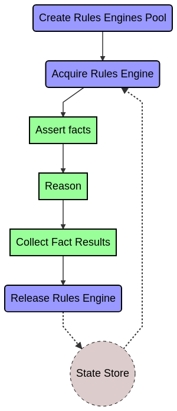

Auracog Rules. Integrating CLIPS with Python
============================================

This document explains how to easily integrate the use of CLIPS rules engines into python. This can be done using the
`RulesEngine`and the `RulesEnginePool` classes.

The following diagram summarizes the steps to use rules engines in python code:




------------

.. contents::

------------


1. Basic Features
-----------------


1.1. Create Rules Engine Pool
`````````````````````````````

It is possible to persist the states of the rules engines. This is an optional feature.
Currently a local file persistence storage is available.


0. Prepare the needed imports

.. code:: python

      from auracog_rules.rules_engines import RulesEngine, RulesEnginePool
      from auracog_rules.rules_engines_persistence import RulesEnginesStore, LocalFileRulesEngineStore

1. Create a directory for the rules states store.

.. code:: bash

  mkdir -p rules_store

2. Create a local store to save rules engines states.

   This is an **optional** step. If no persistent state needs to be stored use `store=None` (or simply do not include
   this parameter, since it is not mandatory)

.. code:: python

  rules_persistence_store = LocalFileRulesEngineStore("rules_store", binary=False)

3. Create a **pool of rules engines**. Load the rules and the rest of the CLIPS code to be used. Multiple files can be
loaded. Take into account that they are loaded in the same order as declared.

   Also define the name of a python library (it should be accessible through the system path) containing all the python
   functions that will be used in the clips code. In this example see auracog_suggestions.custom_functions.

   The pool size defines the number of rules engines to be kept in the pool. If the number of acuired rules engiens at a
   given instant exceeds this size, the acquiring operation will wait until one is available.

   The initial pool size defines the number or rules engines that will be pre-loaded at pool instantiation time. All the
   rule engines not pre-loaded will be created and intialized on demmand (within the limits defined by the pool size).

.. code:: python

    POOL_NAME = "test_pool"  # This is the name of the rules engine pool. Just for informative purposes.
    RULES_FILES = ["../clips_modules/slots_control.clp",
                   "example_suggestions.clp"]
    #FUNCTIONS_PACKAGE_NAME = "auracog_suggestions.custom_functions"
    FUNCTIONS_PACKAGE_NAME = "custom_functions"
    POOL_SIZE = 2
    INITIAL_POOL_SIZE = 2
    rules_engine_pool = RulesEnginePool(POOL_NAME, RULES_FILES,
                                        functions_package_name=FUNCTIONS_PACKAGE_NAME,
                                        pool_size=POOL_SIZE,
                                        initial_pool_size=INITIAL_POOL_SIZE,
                                        store=rules_persistence_store)

1.2. Acquire Rules Engine
`````````````````````````

If an ID is used, the last saved state with that identifier will be loaded. If it does not exist yet, simply initialize
a rules engine without any fact.

The state id is optional. Use `acquire_rules_engine()`:code or `acquire_rules_engine(None)`:code to get a rules engine
without any internal state (just like executing a `reset`:code command).

**Stateless**

.. code:: python

  # Get one instance of a rules engine
  re = rules_engine_pool.acquire_rules_engine()

**Stateful**

.. code:: python

  # Get one instance of a rules engine
  ID = "persistent_state_1"
  re = rules_engine_pool.acquire_rules_engine(ID)

1.3. Assert Facts
`````````````````
The next step is to inject data into the rules engine in the form of facts. This is done using the method **set_facts()**.

The type of the fact depends on the type of the values provided:

- If the type of the value is primitive or list it is asserted as an ordered fact:

  `(<fact_name> <value>+)`:code:

  Example:

  `{"content_name": "star trek"} -> (content_name "star trek")`:code:

  `{"pizza_ingredients": ["cheese" "tomato" "pepperoni"]} -> (pizza_ingredients "cheese" "tomato" "pepperoni")`:code:


- If the value is dictionary or a plain python object it is asserted as an unordered fact:

  `(<fact_name> (<property_name|key> <value>))`:code:

  Asserting unordered facts requires the corresponding deftemplate to be defined in the rules engine.
  Additionally, the corresponding types of the slots/multislots defined in the deftempaltes must be
  compatible with the types of the values.

  Example:
  ::

      {"user":
        {
          "id": "1234asdf56789",
          "requests": ["1234567", "23456789"]
        }
      }
      ->
      (user (id "1234asdf56789") (requests  "1234567", "23456789"))

  In this example it should exist a detemplate similar to this one

  ``(deftemplate (slot id) (multislot requests))``


  It is important to note that the values of the facts are not allowed to be dictionaries or plain objects. For example,
  the following fact specification is not valid:
  ::

      {"user":
        {
          "id": "1234asdf56789",
          "details": {
             "name": "Spock",
             "birth_place": "Vulcan"
           }
        }
      }

  The following is an example of assertion of facts into a rules engine:

  .. code:: python

    # This is the information for user AU123456
    user_info_AU123456 = {
        "id": "AU123456", # User id
        "type": 1,        # Type of user (type of subscription)
        "cluster_id": 2,  # Id of the cluster corresponding to the user (from user profiling)
        "channel_id": "m-home", # Channel
        "at_home": True,  # User is at home
        "stb": True,      # STB is available
    }

    # This is the information on the previously suggested intents to user AU123456
    suggested_intents_user_AU123456 = [
        [
            "suggested_intent",
            {
                "user_id": "AU123456",
                "id": 222,
                "name": "tv.record",
                "num_requested_day": 0,
                "num_requested_week": 3,
                "num_suggested_day": 0,
                "num_suggested_week": 2,
                "num_selected_day": 1,
                "num_selected_week": 1,
                "last_suggested": time.time() - 2*60*60  # Last suggested 2 hours ago
            }
        ],
        [
            "suggested_intent",
            {
                "user_id": "AU123456",
                "id": 191,
                "name": "tv.search",
                "num_requested_day": 2,
                "num_requested_week": 20,
                "num_suggested_day": 0,
                "num_suggested_week": 10,
                "num_selected_day": 2,
                "num_selected_week": 18,
                "last_suggested": time.time() - 5*60  # Last suggested 5 minutes ago
            }
        ],
        [
            "suggested_intent",
            {
                "user_id": "AU123456",
                "id": 194,
                "name": "tv.search_similar",
                "num_requested_day": 0,
                "num_requested_week": 0,
                "num_suggested_day": 0,
                "num_suggested_week": 1,
                "num_selected_day": 0,
                "num_selected_week": 0,
                "last_suggested": time.time() - 3*24*60*60  # Last suggested 3 days ago
            }
        ],
        [
            "suggested_intent",
            {
                "user_id": "AU123456",
                "id": 193,
                "name": "tv.question_time_loc",
                "num_requested_day": 0,
                "num_requested_week": 0,
                "num_suggested_day": 1,
                "num_suggested_week": 8,
                "num_selected_day": 0,
                "num_selected_week": 0,
                "last_suggested": time.time() - 24*60*60  # Last suggested 1 day ago
            }
        ]
    ]

    # Current user session information
    current_session = {
        "user_id": "AU123456",
        "intents": [191, 195]  # t.search, tv.display
    }


    # Set facts
    re.set_facts([["user_info", user_info_AU123456]])
    re.set_facts(suggested_intents_user_AU123456)
    re.set_facts([["current_session", current_session]])


1.4. Reason
```````````


Use the method `reason()`:code:

It can take an additional parameter, `max_fires`:code: to limit the number of rules fires. Default value is 10000.
It prevents the rule engine to infinitely chain rules firing.

Example:

.. code:: python

  re.reason(max_fires=10000)


1.5. Collect Fact Results
`````````````````````````

The results of the processing are tipycally stored in the working memory of the rules engine in the form of facts.

The method `collect_fact_values()`:code returns the values of all the facts with a given name.

For example, if the following facts are asserted into the working memory

::

    (intent_suggestion intent_1 0.231)
    (intent_suggestion intent_2 0.327)
    (entity_suggestion intent_1 entity_34 0.98)

the code

::

    collect_fact_values("intent_suggestion")

would return

::

    [
        [intent_1, 0.231],
        [intent_2, 0.327]
    ]


and

::

    collect_unordered_fact_values("entity_suggestion")

would return

::

    [
        [intent_1, entity_34, 0.98]
    ]


This method works both for ordered and unordered facts. Therefore, if the following facts are asserted

::

    (user (id "123456789"))
    (user (id "987654321"))


the code

::

    collect_fact_values("user")

would return

::

    [
        {"id": "123456789"},
        {"id": "987654321"}
    ]


.. note::

    The values of ordered facts are returned as lists and those of unordered facts as dictionaries.


Example:

If the results of processing are stored as unordered facts called `intent_suggestion`:code:

.. code:: python

    intent_suggestions = re.collect_fact_values("intent_suggestion")
    for s in intent_suggestions:
        print(s)

::

    [194, 0.5, 'gen1']
    [222, 0.3, 'gen2']
    [193, 0.5, 'gen3']
    [193, 0.1, 'gen4']
    [194, 0.1, 'gen5']
    [194, 0.2, 'gen6']
    [191, 0.1, 'gen7']
    [222, 0.1, 'gen8']
    [222, 0.2, 'gen9']
    [191, -1000, 'gen10']


1.6. Release Rules Engine
`````````````````````````

The method `release_rules_engine()`:code: of the class `RulesEnginePool`:code: releases one rules engine and marks it as
idle. Just after releasing a `reset`:code: operation is executed on the engine to reinitialize it.

This method can be used in two ways:

- **Stateless**: Do not keep any internal state information of the rules engine after releasing it.

  Example:

  .. code:: python

      # Release and do not save state
      rules_engine_pool.release_rules_engine(re)


- **Stateful**: Store the internal state of the rules engine with a given identifier.


  Example:

  .. code:: python

      # Release and save state into ID
      rules_engine_pool.release_rules_engine(re, id=ID)

  In this case the state of the rules engine can be recovered invoking

  .. code:: python

      re = rules_engine_pool.acquire(id=ID)


------------------


2. Advanced Usage
-----------------

2.1. Further Control on the Rules Engine
````````````````````````````````````````

It is possible to have access to some lower level properties of the rules engine through the property `env`. This is an
instance of `clips.Environment`. Refer to (https://clipspy.readthedocs.io/en/latest/clips.html#module-clips.environment)
mor further information.

Examples:

.. code:: python

    # Show currently asserted facts
    list(re.env.facts())

::

    [TemplateFact: f-0     (initial-fact),
     ImpliedFact: f-1     (slot __initial_slot__),
     TemplateFact: f-2     (user_info (id "AU123456") (type 1) (cluster_id 2) (channel_id "m-home") (at_home TRUE) (stb TRUE)),
     TemplateFact: f-3     (suggested_intent (user_id "AU123456") (id 222) (name "tv.record") (num_requested_day 0) (num_requested_week 3) (num_suggested_day 0) (num_suggested_week 2) (num_selected_day 1) (num_selected_week 1) (last_suggested 1574151076.60553)),
     TemplateFact: f-4     (suggested_intent (user_id "AU123456") (id 191) (name "tv.search") (num_requested_day 2) (num_requested_week 20) (num_suggested_day 0) (num_suggested_week 10) (num_selected_day 2) (num_selected_week 18) (last_suggested 1574157976.60553)),
     TemplateFact: f-5     (suggested_intent (user_id "AU123456") (id 194) (name "tv.search_similar") (num_requested_day 0) (num_requested_week 0) (num_suggested_day 0) (num_suggested_week 1) (num_selected_day 0) (num_selected_week 0) (last_suggested 1573899076.60553)),
     TemplateFact: f-6     (suggested_intent (user_id "AU123456") (id 193) (name "tv.question_time_loc") (num_requested_day 0) (num_requested_week 0) (num_suggested_day 1) (num_suggested_week 8) (num_selected_day 0) (num_selected_week 0) (last_suggested 1574071876.60553)),
     TemplateFact: f-7     (current_session (user_id "AU123456") (intents 191 195))]


.. code:: python

    # Show currently defined rules
    list(re.env.rules())

::

    [Rule: (defrule MAIN::retract_initial_slot "This rule retracts the __initial_slot__ rule, needed for managing unique slots"
        ?f <- (slot __initial_slot__)
        =>
        (retract ?f)),
     Rule: (defrule MAIN::r_explore_1 "Do not suggest intents that have been just suggested"
        (now ?now)
        (suggested_intent (id ?id) (last_suggested ?last_suggested))
        (test (< (- ?now ?last_suggested) ?*MIN_SUGGESTION_TIME*))
        =>
        (assert (intent_suggestion ?id -1000 (gensym)))),
     Rule: (defrule MAIN::r_explore_2 "Explore on TV domain per day"
        (suggested_intent (id ?id) (num_suggested_day ?num_suggested))
        (test (in ?id ?*TV_DOMAIN_INTENTS*))
        (test (< ?num_suggested ?*MAX_SUGGESTIONS_DAY_TV*))
        =>
        (assert (intent_suggestion ?id 0.1 (gensym)))),
     Rule: (defrule MAIN::r_explore_3 "Explore on TV domain per week"
        (suggested_intent (id ?id) (num_suggested_week ?num_suggested))
        (test (in ?id ?*TV_DOMAIN_INTENTS*))
        (test (< ?num_suggested ?*MAX_SUGGESTIONS_WEEK_TV*))
        =>
        (assert (intent_suggestion ?id 0.2 (gensym)))),
     Rule: (defrule MAIN::r_explore_4 "If tv.display is latest intent, suggest tv.search_similar, tv.record"
        (current_session (user_id ?user_id) (intents $?intents))
        (test (eq (get_last_element $?intents) ?*TV_DISPLAY*))
        =>
        (assert (intent_suggestion ?*TV_SEARCH_SIMILAR* 0.5 (gensym)))
        (assert (intent_suggestion ?*TV_RECORD* 0.3 (gensym)))),
     Rule: (defrule MAIN::r_explore_5 "If tv.search in current session, suggest tv.question_time_loc"
        (current_session (user_id ?user_id) (intents $?intents))
        (test (in ?*TV_SEARCH* $?intents))
        =>
        (assert (intent_suggestion ?*TV_QUESTION_TIME_LOC* 0.5 (gensym)))),
     Rule: (defrule MAIN::r_test_get_time "This rules is used to get the current time"
        (not (now ?))
        =>
        (printout t "Unix time " (get_time) crlf)
        (assert (now (get_time))))]


2.2. Working in *Slot Mode*
```````````````````````````
In some cases it is necessary to reason on state-like data structures. In other words:

- There exist an information structure formed by slot-like elements.
- Its properties are key-value pairs.
- These properties are fixed in the sense that they are not created or erased but simply their values may change.

Working with a rules engine on this kind of structures is tricky ...

**TODO**


2.3. Dealing with Asynchronous Context
``````````````````````````````````````

**TODO**

